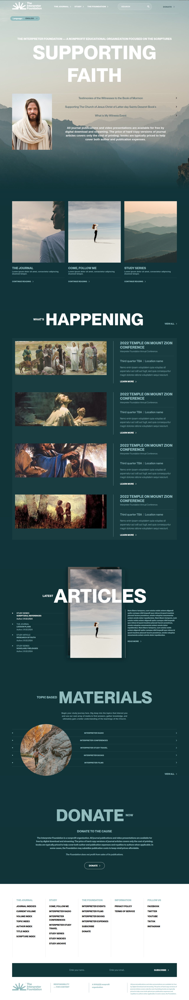

# The Interpreter Foundation Website

Um site moderno e responsivo para The Interpreter Foundation, desenvolvido com HTML, SCSS e JavaScript.



## 🚀 Tecnologias

- HTML5
- SCSS/CSS3
- JavaScript
- Bootstrap 5
- Font Awesome
- GSAP (Animações)
- AOS (Animate On Scroll)
- Gulp (Build e Automação)

## 📦 Estrutura do Projeto 

```
interpreter-foundation/
├── assets/
│   ├── fonts/
│   │   └── ppneuemontreal-.woff
│   └── images/
├── dist/
│   └── css/
├── src/
│ └── scss/
│ ├── components/
│ │ ├── header.scss
│ │ ├── hero.scss
│ │ ├── features.scss
│ │ ├── whats-happening.scss
│ │ ├── latest-articles.scss
│ │ ├── topic-materials.scss
│ │ ├── donate.scss
│ │ └── footer.scss
│ ├── pages/
│ │ └── home.scss
│ ├── fonts.scss
│ ├── variables.scss
│ └── main.scss
├── gulpfile.js
├── package.json
└── index.html
```

## 🛠️ Instalação

1. Clone o repositório

2. Instale as dependências

3. Execute o servidor de desenvolvimento

## 📋 Scripts Disponíveis

- `npm start`: Inicia o servidor de desenvolvimento
- `npm run build`: Compila os arquivos SCSS para CSS
- `npm run watch`: Observa alterações nos arquivos SCSS

## 🎨 Características

- Design Responsivo
- Animações Suaves
- Carregamento Lazy de Imagens
- Interações Dinâmicas
- Navegação Intuitiva
- Otimizado para Performance

## 📱 Seções

1. **Header**
   - Menu de Navegação Responsivo
   - Seletor de Idioma
   - Barra de Pesquisa
   - Botão de Doação

2. **Hero**
   - Título Animado
   - Accordion Interativo
   - Imagem de Destaque

3. **Features**
   - Cards com Hover Effect
   - Imagens com Transição
   - Links "Continue Reading"

4. **What's Happening**
   - Lista de Eventos
   - Imagens com Hover Effect
   - Botão "View All"

5. **Latest Articles**
   - Lista de Artigos Interativa
   - Preview de Imagens com Efeito
   - Conteúdo Dinâmico

6. **Topic Based Materials**
   - Links com Hover Effect
   - Imagem Circular
   - Gradiente nos Links

7. **Donate**
   - Título em Destaque
   - Descrição do Propósito
   - Botão de Doação

8. **Footer**
   - Links Organizados
   - Formulário de Newsletter
   - Informações Institucionais

## 🌐 Compatibilidade

- Chrome (última versão)
- Firefox (última versão)
- Safari (última versão)
- Edge (última versão)
- Responsivo para dispositivos móveis

## 📄 Licença

Este projeto está sob a licença MIT.

## ✨ Contribuição

1. Faça o fork do projeto
2. Crie sua feature branch (`git checkout -b feature/AmazingFeature`)
3. Commit suas mudanças (`git commit -m 'Add some AmazingFeature'`)
4. Push para a branch (`git push origin feature/AmazingFeature`)
5. Abra um Pull Request

## 👥 Autor

Jonathan Vieira - [GitHub](https://github.com/wallacejsv)

## 🙏 Agradecimentos

- [Bootstrap](https://getbootstrap.com/)
- [Font Awesome](https://fontawesome.com/)
- [GSAP](https://greensock.com/gsap/)
- [AOS](https://michalsnik.github.io/aos/)

